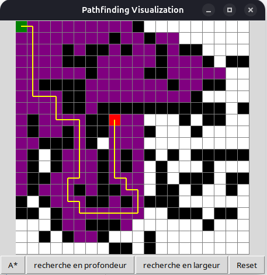

# Pathfinding Visualization

## Description
This project is a **pathfinding algorithm visualizer** built with Python. It allows users to create a grid map, set obstacles, and test different pathfinding algorithms to observe how each algorithm explores the grid and finds a path from a start point (green) to an end point (red). It provides an interactive and educational experience to understand algorithms like A\*, Depth-First Search (DFS), and Breadth-First Search (BFS).

## Features
- **Interactive Grid**: Click to set obstacles and customize the map.
- **Multiple Algorithms**:
  - A\* Algorithm
  - Depth-First Search (DFS)
  - Breadth-First Search (BFS)
- **Visualization**: Step-by-step visualization of the pathfinding process.
- **Reset Functionality**: Easily clear the grid and start fresh.

## Installation
To run the project locally, follow these steps:

1. **Clone the Repository**:
   ```bash
   https://github.com/Jdidi-Tasnim/IA_Animation.git
   cd IA_Animation
   ```

2. **Activate the Virtual Environment**:
   A virtual environment (venv) has already been set up for this project. To activate it:
   ```bash
   source bin/activate
   ```

3. **Install Dependencies**:
   Ensure you have Python installed. Install required libraries using:
   ```bash
   pip install -r requirements.txt
   ```

4. **Run the Project**:
   To test the project, simply run the `main.py` file:
   ```bash
   python main.py
   ```

## Usage
1. Launch the application.
2. Use the grid interface to:
   - **Change Goal** : Right click to change the position of the goal point (Red).
   - **Set Obstacles**: Click to mark cells as obstacles (black).
   - **Run Algorithms**: Use the buttons at the bottom to select and execute an algorithm:
     - `A*` for A-Star Algorithm
     - `recherche en profondeur` for Depth-First Search (DFS)
     - `recherche en largeur` for Breadth-First Search (BFS)
   - **Reset**: Clear the grid and start over.
3. Observe the algorithm's visualization in real-time as it explores the grid.

## Project Structure
The project directory is structured as follows:
```
TP_IA/
|-- A_star/
|   |-- __init__.py
|   |-- a_star_algo.py
|-- recherche_largeur/
|   |-- __init__.py
|   |-- bfs.py
|-- recherche_profondeur/
|   |-- __init__.py
|   |-- profondeur.py
|-- tree/
|   |-- __init__.py
|   |-- node.py
|-- constants.py
|-- main.py
|-- .gitignore
|-- pyvenv.cfg
|-- bin/
```

### constants.py
The `constants.py` file contains global settings for the project, including:
- Grid size, cell size, and recursion limits.
- Colors for different grid states:
  - **Start**: Green
  - **End**: Red
  - **Path**: Yellow
  - **Visited**: Purple
  - **Obstacle**: Black
  - **Empty**: White
- **Animation Speed**: Time delay in milliseconds for visualization.
- **Neighbor Directions**: Directions used to navigate the grid (right, down, left, up):
   ```python
   DIRECTIONS = [(0, 1), (1, 0), (0, -1), (-1, 0)]
   ```

## Algorithms Explained
- **A\***: A heuristic-based search algorithm that finds the shortest path efficiently.
- **Depth-First Search (DFS)**: Explores as far as possible along each branch before backtracking.
- **Breadth-First Search (BFS)**: Explores all nodes at the current depth level before moving to the next level.

## Dependencies
- Python 3.x
- Tkinter (Built-in with Python)

## Authors
- **Oussema Hamouda**
- **Tasnim Jdidi**

## Contributing
Contributions are welcome! To contribute:
1. Fork the repository.
2. Create a new branch:
   ```bash
   git checkout -b feature/your-feature-name
   ```
3. Commit your changes:
   ```bash
   git commit -m "Add your feature"
   ```
4. Push to your branch:
   ```bash
   git push origin feature/your-feature-name
   ```
5. Open a Pull Request.


## Acknowledgments
Special thanks to all contributors and open-source libraries that made this project possible.
